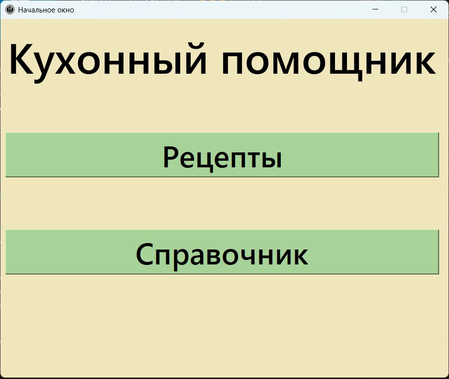
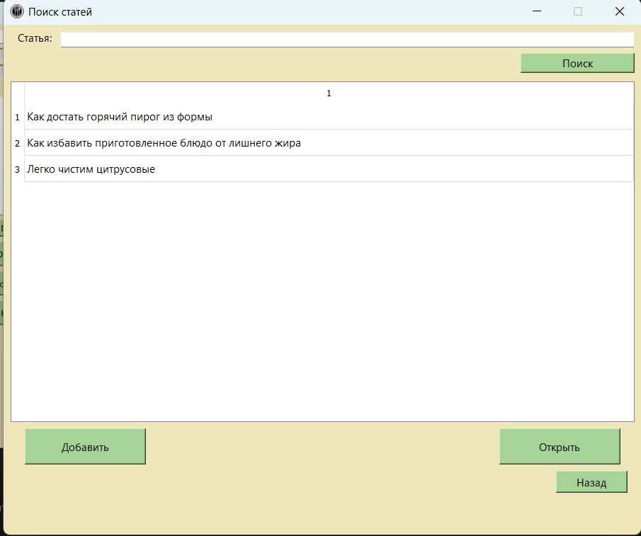
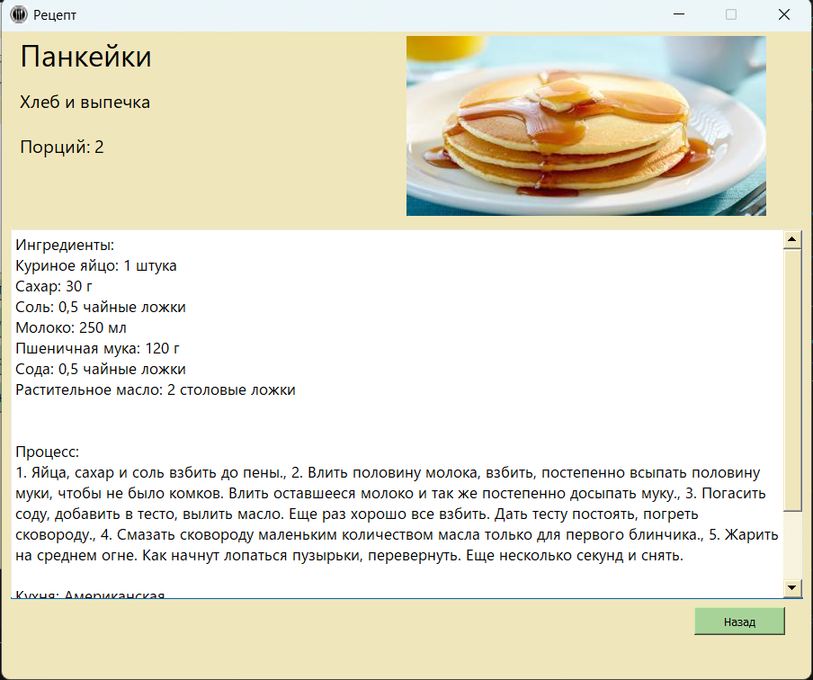
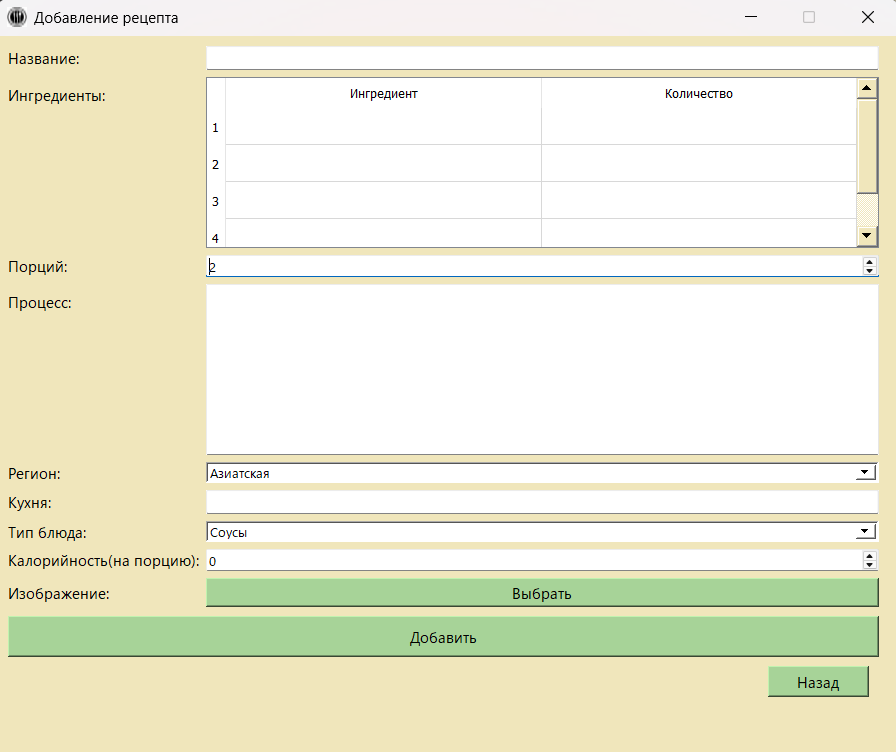
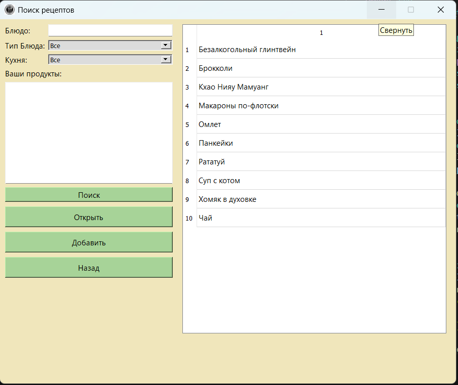
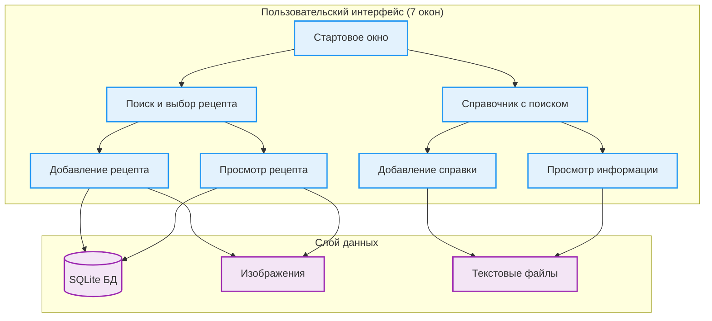

# 🍳 Kitchen Guide - Кухонный помощник

<div align="center">
  
  <p><em>Главное окно приложения Kitchen Guide</em></p>
</div>

[](https://python.org)
[](https://pypi.org/project/PyQt5/)
[](https://sqlite.org)
[](https://pillow.readthedocs.io)

## 🎯 О проекте

**Kitchen Guide** - это настольное приложение для управления кулинарными рецептами, созданное на Python с использованием PyQt5. Приложение представляет собой улучшенную цифровую версию обычной книги рецептов с возможностями поиска, добавления фотографий и удобной организации.

### 💡 Идея проекта

Идея заключалась в создании улучшенной версии обычной бумажной книги рецептов, в которую пользователь мог бы вносить свои рецепты или секреты готовки. Главное преимущество - возможность легко найти рецепт через поиск.

## ✨ Основные возможности

🔍 **Умный поиск** - Поиск блюд по введённым ингредиентам  
📖 **Удобная навигация** - Рецепты и справки открываются двойным щелчком или нажатием Enter  
➕ **Добавление контента** - Возможность добавлять свои рецепты и секреты готовки  
📷 **Фотографии** - К каждому рецепту можно добавить фото  
💾 **Локальное хранение** - Все данные хранятся в SQLite базе данных  
📚 **Справочник** - Раздел с полезной кулинарной информацией  

## 🖥️ Интерфейс приложения

### Поиск и выбор рецептов
<div align="center">
  
  <p><em>Окно поиска рецептов по ингредиентам</em></p>
</div>

### Просмотр рецепта
<div align="center">
  
  <p><em>Детальный просмотр рецепта с фотографией</em></p>
</div>

### Добавление нового рецепта
<div align="center">
  
  <p><em>Форма добавления нового рецепта</em></p>
</div>

### Справочник
<div align="center">
  
  <p><em>Раздел справочника с кулинарной информацией</em></p>
</div>

## 📁 Структура проекта

```
kitchen-guide/
└── Qt Проект/
    └── Progect/
        ├── main.py                 # Основной файл приложения (9 классов)
        ├── Progect.sqlite          # База данных рецептов
        ├── requirements.txt        # Зависимости проекта
        ├── readme.txt             # Техническое описание
        ├── imgs/                  # Папка для изображений рецептов
        ├── texts/                 # Текстовые файлы справочника
        ├── ui_prog/               # UI компоненты
        ├── ingr.csv              # Список ингредиентов
        └── *.jpg                 # Демонстрационные изображения рецептов
```

## 🏗️ Архитектура приложения



## 🚀 Быстрый старт

### Системные требования
- Python 3.7 или выше
- PyQt5 >= 5.15.4
- Pillow >= 8.3.2

### Установка и запуск

1. **Клонирование репозитория**
```bash
git clone https://github.com/mama-lama/kitchen-guide.git
cd kitchen-guide
```

2. **Установка зависимостей**
```bash
cd "Qt Проект/Progect"
pip install -r requirements.txt
```

3. **Запуск приложения**
```bash
python main.py
```

### Зависимости
```
PyQt5 >= 5.15.4
Pillow >=8.3.2
```

## 🔧 Техническая реализация

### Основные компоненты
- **main.py** - содержит всю логику приложения в 9 классах
- **SQLite база данных** - для хранения рецептов и метаданных
- **Pillow** - для обработки и отображения изображений
- **PyQt5** - для создания графического интерфейса

### Классы приложения
1. **Стартовое окно** - главная страница приложения
2. **Окно поиска** - поиск и выбор рецептов
3. **Просмотр рецепта** - детальное отображение рецепта
4. **Добавление рецепта** - форма для создания новых рецептов
5. **Справочник** - раздел с кулинарной информацией
6. **Добавление справки** - создание справочных материалов
7. **Окно информации** - просмотр дополнительной информации

## 🎨 Особенности проекта

### Пользовательский опыт
- **Двойной клик** для быстрого открытия
- **Enter** для подтверждения выбора
- **Поиск по ингредиентам** - находите рецепты по доступным продуктам
- **Фотогалерея** - визуальное представление блюд

### Техническое качество
- **Модульная архитектура** - четкое разделение ответственности
- **Локальное хранение** - никаких внешних зависимостей
- **Обработка изображений** - автоматическое масштабирование и оптимизация
- **Надежная БД** - SQLite для стабильного хранения данных

## 🔮 Возможные улучшения

### Функциональные расширения
- **Расширенный поиск** по статьям справочника
- **Система авторизации** для персональных коллекций
- **Избранные рецепты** - список любимых блюд
- **История приготовления** - отслеживание приготовленных блюд
- **Рейтинговая система** - оценка рецептов
- **Экспорт/импорт** - обмен рецептами с другими пользователями

### Технические улучшения
- **Облачная синхронизация** - доступ с разных устройств
- **Темы оформления** - настройка внешнего вида
- **Голосовые заметки** - аудиокомментарии к рецептам
- **Таймеры готовки** - встроенные уведомления

## 📊 Статистика проекта

- **Язык**: Python 100%
- **Основные технологии**: PyQt5, SQLite, Pillow
- **Архитектура**: 9 классов, MVC паттерн
- **Размер**: Компактное настольное приложение
- **Платформы**: Windows, macOS, Linux

## 👨‍💻 Автор

**Ксения Ширяева** - ведущий разработчик
- Проектирование архитектуры
- Разработка пользовательского интерфейса
- Реализация логики приложения
- Интеграция с базой данных

## 📄 Лицензия

Проект распространяется под лицензией MIT. Подробности в файле LICENSE.

## 🤝 Вклад в проект

Приветствуем предложения по улучшению проекта:

1. Fork репозитория
2. Создайте feature branch
3. Внесите изменения
4. Создайте Pull Request

## 📞 Обратная связь

Если у вас есть вопросы или предложения:
- Создайте Issue в репозитории
- Свяжитесь через GitHub: [@mama-lama](https://github.com/mama-lama)

---

<div align="center">
  <p><strong>Kitchen Guide - ваша цифровая книга рецептов! 🍳✨</strong></p>
  <p><em>Превратите хаос кулинарных идей в организованную коллекцию вкусных решений</em></p>
</div>